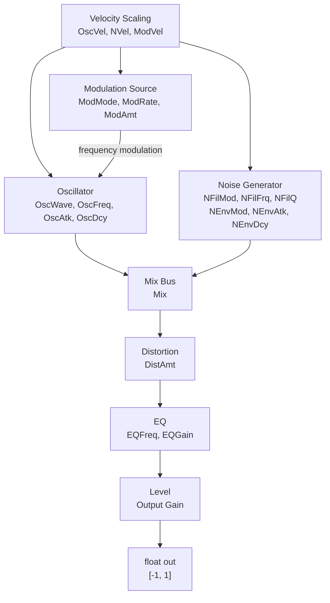

# Synth Signal Path

The PO-32 synth engine renders a single drum hit from 21 float parameters
(`po32_patch_params_t`). All parameters are normalized to `[0.0, 1.0]`.

## Block Diagram

## Oscillator

The oscillator generates the tonal component of the drum sound.

- **OscWave** selects the waveform. `0.0` = sine, `1.0` = saturated sine
  (approaches square). Intermediate values crossfade.
- **OscFreq** maps exponentially from 20 Hz to 20 kHz.
- **OscAtk / OscDcy** control an amplitude envelope with exponential
  attack and decay curves.

## Modulation

The modulation section controls pitch modulation of the oscillator,
which is essential for creating impact transients in kicks, toms,
and other percussive sounds.

- **ModMode** selects the modulation source:
  - `0.0`: exponential decay (pitch sweep)
  - `0.5`: sine LFO
  - `1.0`: noise modulation
- **ModRate** controls the modulation speed.
- **ModAmt** controls modulation depth in semitones (up to 96).

## Noise Generator

An independent noise path with its own filter and envelope:

- **NFilMod** selects the filter type (low-pass to high-pass).
- **NFilFrq** sets the filter cutoff frequency.
- **NFilQ** sets the filter resonance.
- **NEnvMod** selects the noise envelope shape.
- **NEnvAtk / NEnvDcy** control the noise amplitude envelope.

## Mix

**Mix** blends between the oscillator and noise generator.
`0.0` = pure oscillator, `1.0` = pure noise.

## Distortion

**DistAmt** applies waveshaping distortion. `0.0` = clean, `1.0` = hard clip.

## EQ

A single-band parametric equalizer:

- **EQFreq** sets the center frequency.
- **EQGain** boosts or cuts at that frequency (bipolar around 0.5).

## Output

**Level** sets the final output gain.

## Velocity

Three velocity sensitivity parameters (**OscVel**, **NVel**, **ModVel**)
scale how MIDI velocity affects the oscillator level, noise level, and
modulation depth respectively. At `0.0`, velocity has no effect; at `1.0`,
velocity fully controls the parameter.

## Implementation

The synth uses only lookup tables for transcendental functions (sin, cos,
exp, pow). No `<math.h>` trig is needed at runtime. Tables are ~9 KB total
and are embedded as compile-time constants.

Output is mono `float` in `[-1, 1]` at the caller-specified sample rate.
